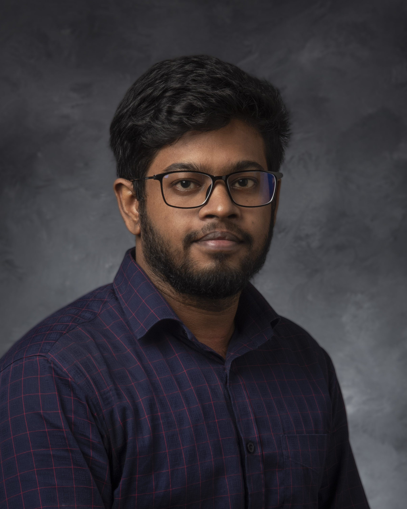

<!--  -->

### 👋 About Raihanul Alam Hridoy

Raihanul Alam Hridoy is a Graduate Teaching Assistant in the Computer Science department at the University of Iowa. A former software engineer with extensive experience in software engineering, machine learning, and interdisciplinary research, he brings a passion for impactful work and commitment to excellence to his academic pursuits.

#### 📜 Notable Achievements

- **CHI'21 Honorable Mention**: Raihan’s project, *Unmochon*, received an Honorable Mention at the CHI'21 conference, underscoring his dedication to meaningful innovation.
- **Top Engineering Ranking**: Raihan ranked 15th nationwide in a competitive engineering exam, earning his place at BUET, Bangladesh’s premier engineering university. Before this, he placed 3rd in the National Science Olympiad and actively participated in various Physics and Math Olympiads.
- **Published Research**: His undergraduate poster presentation was awarded 1st runner-up at the 7th NSysS conference and later fully published in the 12th ICECE, highlighting his early contributions to research.

#### 🧩 Technical Contributions

- **Problem Solving on LeetCode**: Raihan has tackled complex problems on LeetCode and shared his insights, helping others approach coding challenges with clarity.
- **Java Networking and Socket Programming**: With a focus on accessible learning, he has produced online content to demystify Java Networking and socket programming concepts.
- **Phylogenetic Tree Analysis**: Raihan’s interdisciplinary interests include evolutionary biology, where he’s discussed gene and species trees, duplications, and consensus algorithms, bridging computational and biological insights.

#### 💼 Current Work

**Graduate Teaching Assistant** at the **University of Iowa**'s Computer Science Department, Raihan combines his passion for education with his technical expertise. Drawing from his background as a former **Software Engineer at Tekarsh - MarginEdge**, he mentors students while conducting research in machine learning and interdisciplinary applications, committed to delivering impactful academic and research contributions.

<!-- 
As a **Software Engineer at Tekarsh - MarginEdge**, Raihan collaborates with MarginEdge to streamline restaurant management through automation and real-time data insights. His work focuses on leveraging machine learning to enhance invoice processing and ordering efficiency, delivering impactful solutions for restaurant operators.
-->
