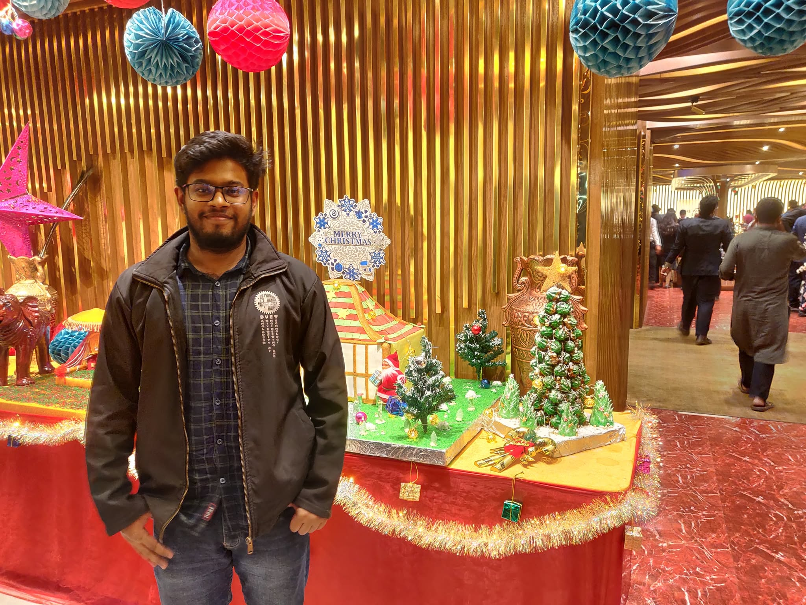

Participated as an **author** at the **12th International Conference on Electrical and Computer Engineering (ICECE 2022)**, held December 21–23, 2022 at **BUET, Dhaka**. The conference was organized by the Department of EEE, BUET and technically co-sponsored by the **IEEE Bangladesh Section**.

