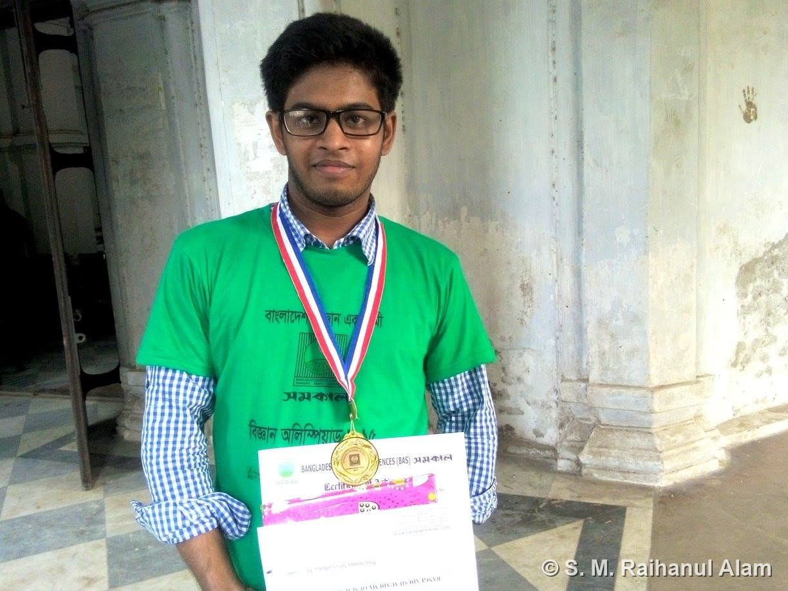

Awarded a **medal and certificate** at the **National Science Olympiad** organized by the **Bangladesh Academy of Sciences (BAS)**, one of the country's premier science competitions for young students.

The award was presented on stage at the national ceremony by members of the academy.

