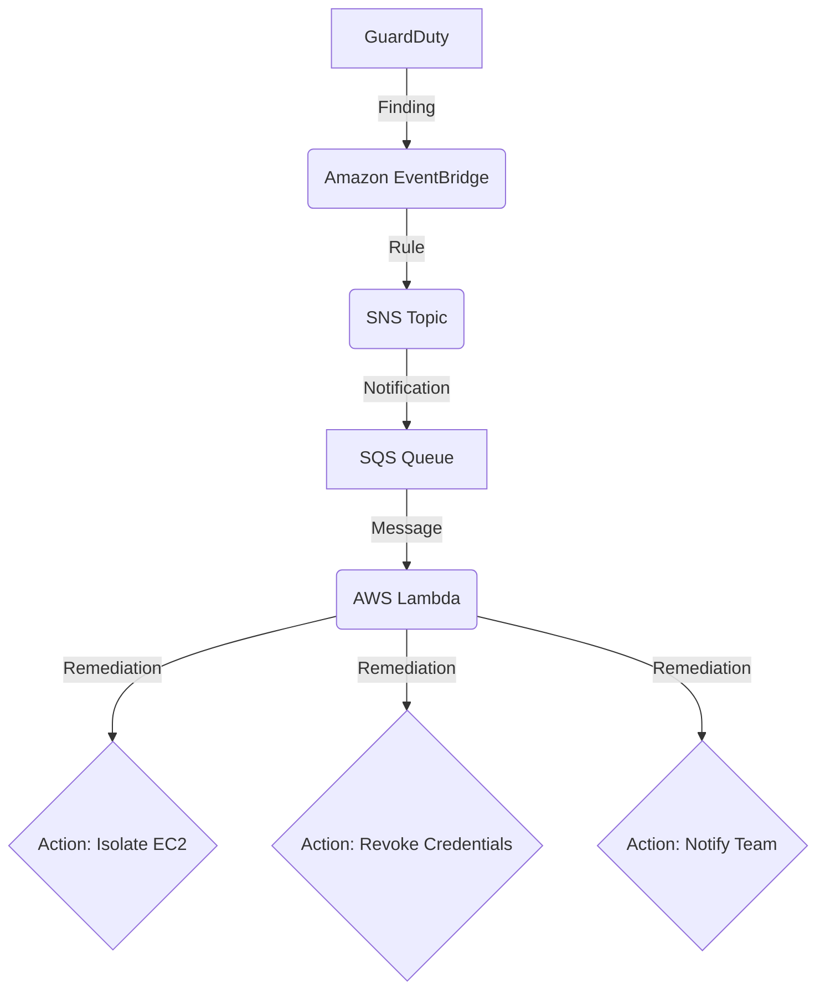

## Introduction to AWS GuardDuty

AWS GuardDuty is a threat detection service that continuously monitors for malicious activity and unauthorized behavior to protect your AWS accounts, workloads, and data stored in Amazon S3. It uses machine learning, anomaly detection, and integrated threat intelligence to identify and prioritize potential threats.

In this post, we'll explore how to use GuardDuty to monitor your environment and how to integrate it with other AWS services like S3, SNS, and SQS to create an automated security response workflow.

## Enabling and Configuring GuardDuty

Getting started with GuardDuty is straightforward. You can enable it with a single click in the AWS Management Console. Once enabled, GuardDuty immediately begins analyzing data from various sources, including:

-   AWS CloudTrail event logs
-   VPC Flow Logs
-   DNS logs

GuardDuty for S3 Protection is also enabled by default and starts monitoring S3 data access events (S3 data plane events) to detect potential security risks, such as unusual data access patterns or suspicious API calls.

## Integrating GuardDuty with S3, SNS, and SQS

While GuardDuty is powerful on its own, its true strength lies in its ability to integrate with other AWS services to automate threat response. Here’s a common and effective workflow:

1.  **GuardDuty Detects a Threat:** GuardDuty identifies a potential security issue, such as an S3 bucket being accessed from a known malicious IP address. This generates a "finding."

2.  **Findings are Sent to Amazon EventBridge:** All GuardDuty findings are automatically sent to Amazon EventBridge as events. You can create rules in EventBridge to filter for specific findings that you want to take action on.

3.  **EventBridge Triggers an SNS Topic:** An EventBridge rule can be configured to send the filtered findings to an Amazon SNS (Simple Notification Service) topic. This allows you to distribute the finding to multiple endpoints.

4.  **SQS Queue Subscribes to the SNS Topic:** To ensure that findings are not lost and can be processed reliably, you can subscribe an SQS (Simple Queue Service) queue to the SNS topic. The SQS queue will store the findings until they are processed.

5.  **Automated Remediation with AWS Lambda:** You can trigger an AWS Lambda function from the SQS queue. This Lambda function can be programmed to perform automated remediation actions, such as:
    -   Isolating the affected EC2 instance by changing its security group.
    -   Revoking the temporary credentials of a compromised IAM role.
    -   Applying a restrictive bucket policy to the affected S3 bucket.
    -   Notifying your security team via Slack or another communication channel.

## Example Workflow Diagram

Here is a visual representation of the workflow:

## Conclusion

By integrating AWS GuardDuty with services like Amazon EventBridge, SNS, SQS, and Lambda, you can move from simple threat detection to a fully automated security response system. This proactive approach not only reduces your response time to potential threats but also minimizes the risk of human error, helping to keep your AWS environment secure.
